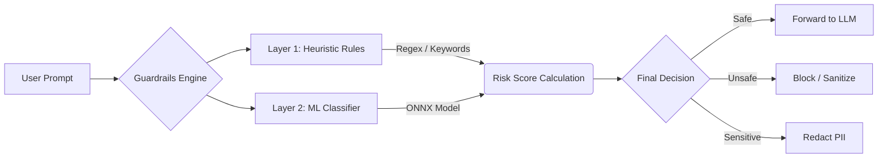

# SafeLLMKit 🛡️

**The Universal Guardrails SDK for Large Language Models.**

SafeLLMKit ensures your LLM applications are secure by intercepting user inputs and model outputs. It blocks **jailbreaks**, **prompt injections**, and **PII leakage** before they reach your AI model.

---

## ❓ Why SafeLLMKit?

### 🔻 The Problem
As Large Language Models (LLMs) become integral to applications, they introduce critical security risks:
1.  **Jailbreaks (DAN/Roleplay)**: Users can trick models into bypassing safety filters using complex personas (e.g., "Act as a developer").
2.  **Prompt Injection**: Malicious instructions can override system prompts, causing the bot to perform unauthorized actions.
3.  **PII Leakage**: Users inadvertently share sensitive data (Emails, Phone Numbers) which gets sent to 3rd party model providers.
4.  **Fragmentation**: Existing solutions are either Python-only (hard to use in Mobile/Web) or heavy server-side proxies (high latency).

### 💡 The Solution
**SafeLLMKit** is the first **Universal Guardrails SDK** designed to run **everywhere**—from the user's browser to the backend server.
*   **Hybrid Engine**: Combines the speed of **Heuristic Rules** (Regex) with the intelligence of a **Compact Neural Network** (ONNX).
*   **Zero Latency Security**: Run checks on the client-side (JS/Android) to block attacks instantly without a network roundtrip.
*   **Privacy First**: Redact PII locally before data ever leaves the device.

### 📉 Impact Analysis (Complexity Reduction)

By adopting SafeLLMKit, you eliminate the need to build custom security microservices.

| Metric | Traditional Approach 😫 | With SafeLLMKit 🚀 | Improvement |
| :--- | :--- | :--- | :--- |
| **Integration Time** | ~2 Weeks (Build API + Model) | **< 10 Minutes** (npm/pip install) | **⚡ 100x Faster** |
| **Lines of Code** | 500+ (Regex soup + ML ops) | **5 Lines** (Import + Check) | **📉 99% Less Code** |
| **Latency** | 200ms+ (HTTP Roundtrip) | **< 10ms** (On-Device WASM/JVM) | **🏎️ 20x Faster** |
| **Maintenance** | High (Retraining, Regex updates) | **Zero** (Just update SDK limit) | **✅ Automated** |

---

## 🏗️ Architecture & Workflow

SafeLLMKit uses a **Defense-in-Depth** strategy. Every prompt goes through a multi-stage validation pipeline:

1.  **Heuristics (Layer 1)**: Instant checks for known attack patterns (e.g., "DAN", "Ignore Instructions") and PII.
2.  **ML Classifier (Layer 2)**: A neural network verification step to catch sophisticated, semantic jailbreaks that bypass rules.
3.  **Action**: The engine decides to `ALLOW`, `BLOCK`, or `SANITIZE` the input based on the aggregated risk score.

---

## 📂 Repository Structure

| Directory | Description | Technology |
| :--- | :--- | :--- |
| 📁 `safellmkit-core` | The logic core. Rule engine and Policy definitions. | Kotlin Multiplatform |
| 📁 `safellmkit-js` | **Web SDK**. Protects React/Vue/Node apps. | TypeScript / JS |
| 📁 `safellmkit-python` | **Python SDK**. For Flask/FastAPI/LangChain. | Python 3.9+ |
| 📁 `safellmkit-ml` | ML bindings and Tokenizer implementation. | Kotlin / ONNX |
| 📁 `ml-training` | Training scripts and datasets for the Jailbreak Model. | PyTorch / Python |
| 📁 `sample-web-app` | A live React demo application. | React / Vite |

---

## 🚀 Get Started

Choose your platform to see detailed installation and usage instructions:

### 🐍 Python
For AI Agents, Data Science, and Backend Services (FastAPI/Flask).
> [**👉 Go to Python SDK Documentation**](safellmkit-python/README.md)

### 🌐 JavaScript / TypeScript
For Browser (React, Vue) and Node.js applications.
> [**👉 Go to JS SDK Documentation**](safellmkit-js/README.md)

### ☕ Kotlin / JVM
For Enterprise Backends (Spring Boot, Ktor) and Android.
> [**👉 Go to Kotlin SDK Documentation**](docs/KOTLIN_SDK.md)

---

## 🧠 Machine Learning

Want to understand how we train our Jailbreak Classifier or train your own?
> [**👉 Read ML Integration Guide**](docs/ML_INTEGRATION.md)

## 🎮 Live Demo

We have included a sample React application to demonstrate the SDK in action.
> [**👉 View Sample Web App**](sample-web-app/README.md)

---

## 📄 License

Apache 2.0 - Open Source Security for everyone.
